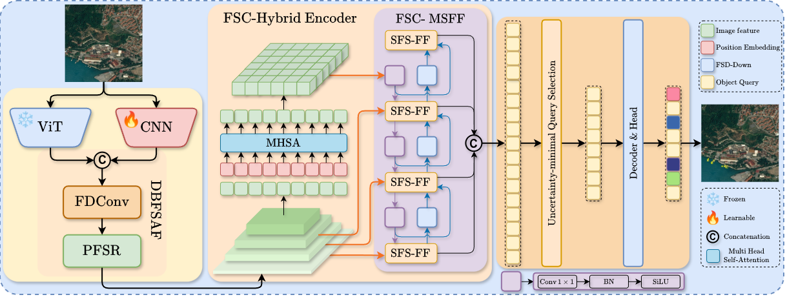

<h1 align="center">[ECCV 2026] FSDC-DETR: A Frequency-Spatial Domain Collaborative DETR for Small Object Detection</h1>
<p align="center">
  <a href="LICENSE">
    
  </a>
  <a href="https://arxiv.org/abs/2607.05176">
    
  </a>
</p>

<p align="justify">
    FSDC-DETR is a Frequency-Spatial Domain Collaborative Detection Transformer for precise small object detection. It explicitly constructs, propagates, and preserves frequency-aware representations through DBFSAF, SFS-FF, and FSD-Down, effectively reducing high-frequency degradation during multi-scale feature fusion. FSDC-DETR achieves state-of-the-art performance on VisDrone-DET2019 and AITODv2, with significant gains especially for small object detection.
</p>

<div align="center">
  Aiwen Liu<sup>1</sup>,
  Chengguang Zhu<sup>1, 📧</sup>,
  Gang Wang<sup>1</sup>,
  Dandan Zhu<sup>2</sup>,<br>
  Haodong Lin<sup>1</sup>,
  Yan Wang<sup>4</sup>,
  Huiyu Zhou<sup>3</sup>,
  Zhengyi Pan<sup>1</sup>
</div>

<p></p>

<div align="center">
<i>
1. Micro-Intelligence Co., Ltd, Shanghai 201100, China
</i>
</div>

<div align="center">
<i>
2. East China Normal University, Shanghai 200241, China
</i>
</div>

<div align="center">
<i>
3. University of Leicester, Leicester LE1 7RH, UK
</i>
</div>

<div align="center">
<i>
4. Chongqing Normal University, Chongqing 401331, China
</i>
</div>

<p></p>

<p align="center">
<strong> 🎉 Accepted by ECCV 2026. </strong> 
</p>
<p align="center">
<strong>😽 If you like our work, PLZ give us a small ⭐⭐.</strong>
</p>

<p align="center">
  
</p>

## Quick start

### Setup

```
conda create -n fsdc python=3.11
conda activate fsdc
pip install -r requirements.txt
```

### Data Prepararion

#### VisDrone

#### AITODv2

## 🚀 Updates

- **2026-7-7**: Paper released.

## Citation

If you use `FSDC-DETR` or its methods in your work, PLZ cite the following Bib entries:

<details open>
<summary> bibtex </summary>

```latex
@misc{liu2026fsdcdetrfrequencyspatialdomaincollaborative,
  title={FSDC-DETR: A Frequency-Spatial Domain Collaborative DETR for Small Object Detection}, 
  author={Aiwen Liu and Chengguang Zhu and Gang Wang and Dandan Zhu and Haodong Lin and Yan Wang and Huiyu Zhou and Zhengyi Pan},
  year={2026},
  eprint={2607.05176},
  archivePrefix={arXiv},
  primaryClass={cs.CV},
  url={https://arxiv.org/abs/2607.05176}, 
}
```

</details>

## Acknowledgement

Our work is built upon [DEIMv2](https://github.com/Intellindust-AI-Lab/DEIMv2). We sincerely thank the DEIMv2 authors.

⭐ Feel free to contribute and reach out if you have any questions! ⭐
